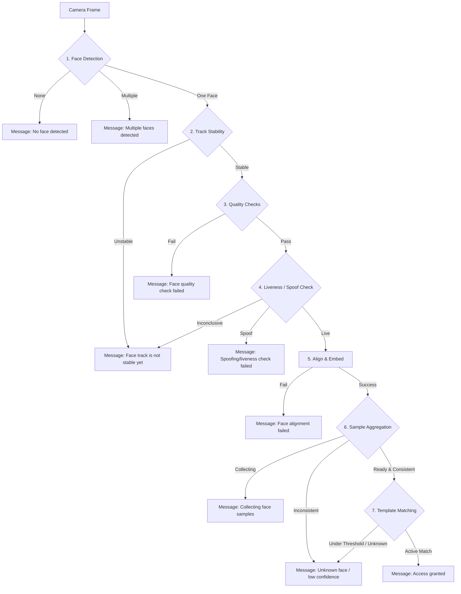

# Guide: Fine-Tuning Facial Recognition & Access Control Thresholds

This guide provides a detailed explanation of how to tune the biometric and algorithmic thresholds in the facial recognition access control pipeline to optimize user experience and security. It maps each user-facing output message to its underlying threshold parameters and provides a step-by-step tuning runbook.

---

## Overview of the Access Control Flow

The access control system evaluates incoming camera frames sequentially using the following pipeline:



---

## Output Message Mapping & Threshold Reference

Each output message in the access control application is triggered by a specific state in `AuthenticationResult`. Below is the complete mapping of messages, their triggers, and the environment variables or code configurations used to tune them.

### 1. "Access granted"
* **Authentication Result:** `AuthenticationResult.GRANT`
* **Trigger:** A stable face passes detection, quality, and liveness checks, and its aggregated embedding matches a database template above the minimum similarity threshold.
* **Key Tuning Parameters:**
  * **`EDGE_ACCESS_RECOGNITION_THRESHOLD`** (Default: `0.75`)
    * *Type:* Cosine similarity threshold for verification (values range from `0.0` to `1.0`).
    * *Tuning:* Set strictly to prevent false positives. If legitimate users are being denied access under normal conditions, try lowering this incrementally (e.g., to `0.72` or `0.70`). Avoid setting below `0.65`.
  * **`EDGE_ACCESS_MIN_EMBEDDING_SAMPLES`** (Default: `5`)
    * *Type:* Integer count of face embeddings to collect.
    * *Tuning:* Higher values increase latency before access is granted (since it needs 5 valid frames) but reduce noise/false matches. Reduce to `3` or `4` to speed up door opening, at the cost of slight biometric confidence.
  * **`EDGE_ACCESS_CANDIDATE_CONSISTENCY_RATIO`** (Default: `0.8`)
    * *Type:* Ratio of frames matching the target user.
    * *Tuning:* If `0.8`, then 80% of the collected frames in the window must match the same candidate ID. Lowering this to `0.7` makes the system more tolerant to transient misidentifications under fluctuating lighting.

---

### 2. "Unknown face or low-confidence match"
* **Authentication Result:** `AuthenticationResult.DENY_NO_MATCH`
* **Trigger:** The system collects `max_embedding_samples` frames but cannot match the user with high confidence, or the candidate identity changes too much during the acquisition window.
* **Key Tuning Parameters:**
  * **`EDGE_ACCESS_RECOGNITION_THRESHOLD`** (Default: `0.75`)
    * *Tuning:* Raising this threshold guarantees that only high-confidence matches are granted entry, reducing False Acceptance Rate (FAR) but increasing False Rejection Rate (FRR) which leads to this "unknown" denial message.
  * **`EDGE_ACCESS_MAX_EMBEDDING_SAMPLES`** (Default: `10`)
    * *Type:* Max frame buffer size for aggregation.
    * *Tuning:* If users are denied too quickly (i.e. before they get close or look straight at the camera), increase this to `12` or `15` to give them more time to present a matching face.

---

### 3. "Only one user is allowed within the frame."
* **Authentication Result:** `AuthenticationResult.DENY_MULTIPLE_FACES`
* **Trigger:** The object detector detects more than one face within the active region.
* **Key Tuning Parameters:**
  * **`EDGE_ACCESS_DETECTION_THRESHOLD`** (Default: `0.50`)
    * *Type:* SCRFD face detector confidence limit.
    * *Tuning:* If background details (paintings, screen displays) are falsely detected as secondary faces, raise this threshold to `0.60` or `0.65` to ignore low-confidence false detections.
  * **`EDGE_ACCESS_MIN_FACE_SIZE`** (Default: `48`)
    * *Type:* Minimum bounding box width/height in pixels.
    * *Tuning:* If bystanders far in the background are triggering the multiple-face denial, raise this limit to `80` or `100` so only the person standing directly in front of the kiosk is registered.

---

### 4. "Spoofing/liveness check failed."
* **Authentication Result:** `AuthenticationResult.DENY_SPOOF`
* **Trigger:** The face tracker registers the face, but the motion or pose changes are insufficient over a designated frame duration (indicating a printed photo or static screen presentation).
* **Key Tuning Parameters (in code at `MotionSpoofDetector`):**
  * **`motion_threshold`** (Default: `3.0`)
    * *Type:* Cutoff for frame-to-frame pixel change in the cropped face ROI.
    * *Tuning:* If the environment has severe camera noise (which looks like motion to the algorithm), raise this to `4.0` or `5.0`. If users stand very still and get falsely rejected as spoofing, lower this to `2.5`.
  * **`pose_threshold`** (Default: `0.025`)
    * *Type:* Yaw proxy deviation limit.
    * *Tuning:* Lowering this makes the system accept smaller head movements as "live". Raise it to `0.035` to force users to turn their heads slightly to verify.
  * **`spoof_frames`** (Default: `10`)
    * *Type:* The number of consecutive stagnant frames before raising a spoof alarm.
    * *Tuning:* Lowering this (e.g., to `6` frames) makes spoof detection faster but increases false rejections of legitimate users who look straight ahead without moving.

---

### 5. "No face detected"
* **Authentication Result:** `AuthenticationResult.RETRY_NO_FACE`
* **Trigger:** The SCRFD detector returns zero candidate bounding boxes in the frame.
* **Key Tuning Parameters:**
  * **`EDGE_ACCESS_DETECTION_THRESHOLD`** (Default: `0.50`)
    * *Tuning:* Lowering this (e.g., to `0.40`) allows detection in extremely dark or low-contrast conditions, but may introduce false boxes.
  * **`EDGE_ACCESS_DETECTOR_MIN_BOX_SIZE`** (Default: `16`)
    * *Tuning:* Lower this if distant face detections are completely missed, though the face quality filter will still require `EDGE_ACCESS_MIN_FACE_SIZE` (48px) for access validation.

---

### 6. "Face track is not stable yet"
* **Authentication Result:** `AuthenticationResult.RETRY_UNSTABLE_TRACK` (or when liveness is inconclusive)
* **Trigger:** A face is visible, but tracking coordinates are jumping or the face has not been tracked continuously for the minimum duration.
* **Key Tuning Parameters:**
  * **`EDGE_ACCESS_MIN_STABLE_FRAMES`** (Default: `5`) & **`EDGE_ACCESS_MIN_STABLE_DURATION_MS`** (Default: `250`)
    * *Tuning:* Decreasing these speed up the initial detection lock but might allow low-quality blurry frames from when the user first walks into view to enter the recognition buffer.
  * **`EDGE_ACCESS_MAX_MISSED_FRAMES`** (Default: `3`) & **`EDGE_ACCESS_TRACK_TIMEOUT_MS`** (Default: `1000`)
    * *Tuning:* Raise these if quick blinks, fast head turns, or lighting changes cause the tracker to break the track and reset user authentication.

---

### 7. "Face quality check failed: [reason]"
* **Authentication Result:** `AuthenticationResult.RETRY_LOW_QUALITY`
* **Trigger:** The face passes detection and tracking, but fails one of the quality metrics in the `FaceQualityConfig`.
* **Specific Quality Checks & Parameters to Tune in Code:**
  * **`face_too_small` / `invalid_inter_eye_distance`**
    * *Thresholds:* `min_face_size` (Default: `48`), `min_inter_eye_distance` (Default: `18.0`).
    * *Tuning:* Lower these if users have to stand excessively close to the camera, but note that small face images contain fewer features and yield lower embedding matching accuracy.
  * **`face_too_blurry`**
    * *Threshold:* `min_sharpness` (Default: `0.18`).
    * *Tuning:* If fast-moving users or low shutter speeds trigger blur warnings, decrease this to `0.14` or `0.12`.
  * **`face_too_dark` / `face_overexposed`**
    * *Thresholds:* `min_brightness` (Default: `45.0`), `max_brightness` (Default: `215.0`).
    * *Tuning:* Adjust these limits if the kiosk is installed in a permanent low-light corner or outdoors with harsh sunlight exposure.
  * **`face_low_contrast`**
    * *Threshold:* `min_contrast` (Default: `25.0`).
    * *Tuning:* Lower this to `20.0` or `18.0` if soft, diffuse overhead lighting causes contrast rejections.
  * **`face_yaw_too_large` / `face_pitch_too_large` / `face_roll_too_large`**
    * *Thresholds:* `max_yaw_degrees` (Default: `30.0`), `max_pitch_degrees` (Default: `25.0`), `max_roll_degrees` (Default: `25.0`).
    * *Tuning:* Increase these thresholds if the camera is mounted at an angle (e.g. higher up pointing down) to allow off-angle verification, but beware that extreme face angles degrade recognition performance.
  * **`overall_quality_too_low`**
    * *Threshold:* `min_overall_score` (Default: `0.45`).
    * *Tuning:* The weighted sum of all face metrics. Decrease to `0.38` or `0.40` if users fail due to combined borderline scores, even though their individual parameters (pose, illumination, size) look acceptable.

---

## Systematic Tuning Runbook

To tune these thresholds effectively, follow this step-by-step process:

### Step 1: Collect Test Footage
Always record raw camera feeds of users approaching the kiosk in different lighting conditions (morning, noon, night, fluorescent lighting, backlight). Use these recordings to evaluate frame rates and biometric scores offline.

### Step 2: Establish the Biometric Baseline
1. Enroll a set of test users.
2. Run the access control pipeline in a test environment with `EDGE_LOG_LEVEL=DEBUG` or inspect the logged authentication events.
3. Observe the reported `similarity` scores for successful matching attempts:
   * **Target:** Successful matches should ideally have a similarity of `0.80` to `0.92`.
   * **Intruder/Unknown Test:** Have unregistered users stand in front of the camera. Their scores should stay below `0.60`.
4. Choose the optimal `recognition_threshold` (usually the midpoint between the lowest genuine user similarity and the highest impostor similarity, typically around `0.72` to `0.75`).

### Step 3: Calibrate Face Quality Checks
1. If users complain about "Face quality check failed" messages:
   * Look at the kiosk log output to find the exact reason string (e.g., `face_too_dark`, `face_too_blurry`).
   * Modify the corresponding parameters in `FaceQualityConfig` in your local code.
2. Test that poor quality inputs (e.g., highly angled views, faces half-covered, or extreme motion blur) are correctly blocked, as they can cause incorrect matching behavior.

### Step 4: Adjust Liveness/Anti-Spoofing
1. Test with a high-resolution printed photo of an enrolled user, and a video playback of an enrolled user on a smartphone/tablet.
2. If the system grants entry:
   * Set `EDGE_ACCESS_REQUIRE_LIVENESS=True`.
   * Decrease the `spoof_frames` parameter in `MotionSpoofDetector` to trigger a spoof rejection faster.
   * Increase `motion_threshold` or `pose_threshold` to make the motion heuristic stricter.
3. If legitimate, live users get rejected with "Spoofing check failed":
   * Lower `pose_threshold` slightly or increase `spoof_frames` to `12` or `15` to give them more time to blink or move their head.

### Step 5: Verify Changes under Load
Run the automated access control test suite to ensure that your local threshold modifications do not break unit tests:
```powershell
pytest edge/facial_recognition/tests/test_access_control_logic.py
```
